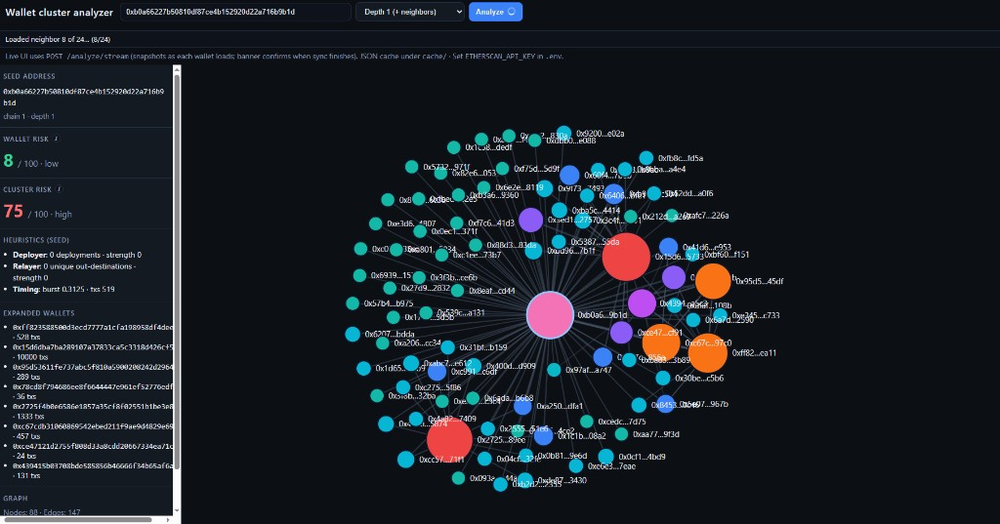

# Cluster Analyzer

Web tool for **EVM wallet addresses** (same `0x…` format on Ethereum, Polygon, and other EVM chains). It pulls normalized transaction lists through an **Etherscan-compatible HTTP API** (default: [Etherscan](https://etherscan.io/apis) V2 with **`CHAIN_ID=1`** Ethereum mainnet). Point `ETHERSCAN_BASE_URL` and `CHAIN_ID` in `.env` at another explorer that uses the same API shape if you need another network.

Use cases include **AML-style triage**, **open-source intelligence**, and **forensics prototyping**: explore who a wallet transacts with, visualize a local **cluster** around the seed, and read **interpretable risk signals** (not legal or compliance verdicts—the scores are heuristic).

## What it detects

- **Counterparty graph** — Nodes are addresses; edges aggregate native-value transfers (`value` field) between `from` and `to`. The UI subgraph keeps the seed, edges incident to the seed, and edges **between direct neighbors** of the seed (so shared peers among neighbors appear as links).
- **Neighbor selection (depth ≥ 1)** — Counterparties of the seed are ranked by how often they appear in the seed’s successful txs; the top **N** wallets are fetched (default **24**, capped higher when `depth=2`). **`depth=0`** analyzes only the seed (no extra wallets).
- **Per-wallet heuristics** — Deployer-style activity, outgoing fan-out / small-value pattern, hourly burst density, and inbound **fund concentration** (share of native inflow from the largest sender). Each loaded wallet (seed + neighbors) gets a **0–100** score and label (`low` / `medium` / `high`).
- **Cluster score** — A rollup over those wallet scores (emphasizes the worst wallet, blends in the average) so you get one **cluster-level** number alongside the seed’s own score.

## Risk heuristics (as implemented)

Signals are computed from the **transaction list** returned by the explorer (successful txs only where `isError != "1"`). The wallet score is a weighted blend of four **0–1** strengths:

| Component | Weight | Meaning |
|-----------|--------|---------|
| **Deployer** | 28% | Count of **contract creations** from this wallet (transactions with an empty `to` field). Higher deployment count and share of txs that are deployments increase the signal. |
| **Relayer-style fan-out** | 32% | Many **distinct outgoing destinations** and a high share of **small native outflows** (outgoing `value` ≤ **0.1** of the chain’s native unit, e.g. ETH on mainnet). Intended to surface dispersal / automation-like patterns, not a labeled “mixer” flag. |
| **Timing bursts** | 20% | Activity in **1-hour** buckets: dense hours (starting from **8+** txs in the same hour) increase the burst score. |
| **Fund concentration** | 20% | **Inbound native** transfers to this wallet (`to` = wallet, `from` ≠ wallet, positive `value`): share of total inbound wei from the **single largest** `from` address. A 0–1 **concentration strength** ramps from **50%** share upward (full weight near **~95%** from one sender). Classic AML-style single-source funding heuristic; token flows are not included unless the API exposes them in this list. |

**Cluster aggregation:** `cluster.score ≈ 0.65 × max(wallet scores) + 0.35 × average(wallet scores)` (capped at 100), with the same low/medium/high bands as the wallet score (thresholds at **40** and **70**).

For how clusters and scores are meant to be interpreted (and known limits), see [METHODOLOGY.md](METHODOLOGY.md).

**Not in scope today:** cross-wallet “same factory deployer” tracing, or full chain-specific decoding (ERC-20/NFT transfers are not the primary edge model unless reflected in the normalized `from`/`to`/`value` you get from the API).

## Example response (anonymized)

Shape returned by `POST /analyze` (fields mirror `_assemble_report` in `backend/main.py`):

```json
{
  "address": "0xabc…def",
  "depth": 1,
  "chain_id": 1,
  "risk": {
    "wallet": {
      "score": 12,
      "label": "low",
      "components": {
        "deployer_weighted": 0.0,
        "relayer_weighted": 6.2,
        "timing_weighted": 5.8,
        "fund_concentration_weighted": 4.0
      }
    },
    "cluster": {
      "score": 58,
      "label": "medium",
      "max_wallet": 72,
      "avg_wallet": 34.2
    }
  },
  "heuristics": {
    "deployer": {
      "contract_deployments": 0,
      "deploy_ratio": 0.0,
      "deployer_strength": 0.0
    },
    "relayer": {
      "unique_out_destinations": 18,
      "outgoing_count": 240,
      "small_value_out_ratio": 0.31,
      "fan_out_ratio": 0.075,
      "relayer_strength": 0.155
    },
    "timing": {
      "tx_count": 512,
      "median_gap_seconds": 420.5,
      "burst_score": 0.232
    },
    "fund_concentration": {
      "inbound_native_count": 48,
      "unique_inbound_senders": 6,
      "total_inbound_wei": 1250000000000000000,
      "top_sender": "0xfeed…",
      "top_sender_share": 0.612,
      "concentration_strength": 0.249
    }
  },
  "neighbors": [{ "address": "0x…", "tx_count": 10000 }],
  "graph": { "node_count": 42, "edge_count": 71, "nodes": [], "edges": [] }
}
```

(`per_wallet` repeats the wallet block per loaded address; `graph.nodes` / `graph.edges` are populated in real responses.)

## Requirements

- Python 3.12+ (recommended)
- An [Etherscan API key](https://etherscan.io/apis) (or equivalent for your chosen base URL)

## Setup

1. Clone the repository and install dependencies:

```bash
cd Cluster-Analyzer
python -m venv .venv
.venv\Scripts\activate
pip install -r requirements.txt
```

On Linux or macOS, use `source .venv/bin/activate` instead of the Windows activation line above.

2. Environment variables: copy `.env.example` to `.env` and set `ETHERSCAN_API_KEY`. Optionally set `ETHERSCAN_BASE_URL` and `CHAIN_ID` for another Etherscan-compatible network.

## Running

From the project folder (with the virtual environment activated):

```bash
uvicorn backend.main:app --reload
```

Open the browser at the server root (by default `http://127.0.0.1:8000/`) for the UI. The documented API is at `/docs` (Swagger).

## UI preview

Example of the live graph, risk panel, and streaming load progress (depth 1):



The UI uses **`POST /analyze/stream`** (Server-Sent Events): each `snapshot` event carries the same report shape as `/analyze` while neighbors load.

## Main API

| Method | Path | Description |
|--------|------|-------------|
| GET | `/health` | Health check |
| POST | `/analyze` | Full report: risk, heuristics, neighbors, graph |
| POST | `/analyze/stream` | SSE stream: incremental `snapshot` events as data loads |
| GET | `/graph` | Graph JSON only (lighter than `/analyze`) |

The `POST /analyze` and `/analyze/stream` bodies accept `address`, `depth` (0–2), `force_refresh`, and optional `neighbor_limit`.

## Project layout

- `backend/` — FastAPI, cluster engine, transaction fetch, heuristics, and scoring
- `frontend/` — Static UI and graph visualization
- `docs/examples/` — Screenshots and other visual examples
- `cache/` — Local transaction cache (JSON; not versioned in git)

## License

Use of this repository is governed by the project owner.
